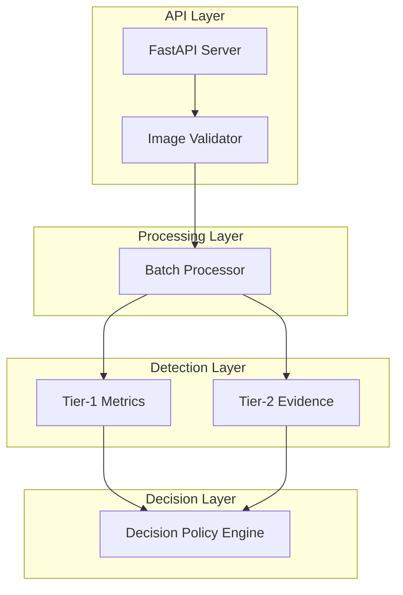

<div align="center">

# ImageForensics-AI

[](https://www.python.org/downloads/)
[](https://fastapi.tiangolo.com/)
[](LICENSE)
[](https://github.com/psf/black)
[](https://www.docker.com/)
[](https://huggingface.co/spaces)
[](https://opencv.org/)
[](https://numpy.org/)
[](https://scipy.org/)
[](https://pydantic-docs.helpmanual.io/)
[](https://www.uvicorn.org/)


> **A transparent, multi-tier evidence-first screening system for identifying images requiring human review in production workflows**

</div>

---

## 📖 Table of Contents
- [Overview](#-overview)
- [Key Features](#-key-features)
- [Architecture Overview](#-architecture-overview)
- [Installation](#-installation)
- [Quick Start](#-quick-start)
- [Documentation](#-documentation)
- [Technical Details](#technical-details)
- [API Documentation](#api-documentation)
- [System Architecture](#-system-architecture)
- [Performance](#performance--accuracy)
- [Ethical Considerations](#-ethical-considerations--limitations)
- [License](#-license)

---

## 🎯 Overview

**ImageForensics-AI** is a **Two-Tiered evidence-first screening tool** designed to reduce manual review workload by analyzing images through statistical metrics (Tier-1) and declarative evidence (Tier-2), then resolving through a deterministic decision policy.

### What This Is
✅ A workflow efficiency tool with evidence-first architecture  
✅ A transparent, explainable multi-tier detector  
✅ A model-agnostic screening system with declarative evidence  
✅ A first-pass filter with policy-based decisions

### What This Is Not
❌ A definitive "real vs fake" classifier  
❌ A black-box deep learning detector  
❌ A system claiming near-perfect accuracy on 2025 AI models

---

## 🚀 Key Features

- **Tiered Analysis**: 
  - **Tier-1**: 5 statistical metric detectors
  - **Tier-2**: Declarative evidence analyzers (EXIF, watermark)
  - **Decision Layer**: Evidence-first policy engine

- **Multi-Class Decisions**: Four nuanced outcomes beyond binary classification

- **Full Explainability**: Per-metric scores, evidence findings, and human-readable explanations

- **Batch Processing**: Parallel analysis of up to 50 images with progress tracking

- **Multiple Export Formats**: CSV, JSON reports for integration into existing workflows

- **No External Dependencies**: No ML models, no cloud APIs - fully self-contained

- **Production Ready**: FastAPI backend, comprehensive error handling, configurable thresholds

---

## 🏗️ Architecture Overview

### Two-Tier Analysis with Evidence-First Decision

```mermaid
flowchart TD
    %% Overall System Flow
    Input[📁 Input: Image File]
    
    %% Tier 1: Statistical Metrics
    subgraph Tier1 [Tier 1: Statistical Metrics]
        Gradient[Gradient PCA<br/>Eigenvalue Analysis]
        Frequency[Frequency FFT<br/>Spectral Analysis]
        Noise[Noise Pattern<br/>Sensor Noise Analysis]
        Texture[Texture Stats<br/>Smoothness Detection]
        Color[Color Distribution<br/>Saturation & Hue Analysis]
    end
    
    %% Tier 1 Aggregation
    Aggregator1[Signal Aggregator<br/>Weighted Ensemble]
    Status1{Detection Status}
    
    %% Tier 2: Declarative Evidence
    subgraph Tier2 [Tier 2: Declarative Evidence]
        EXIF[EXIF Analyzer<br/>Metadata Forensics]
        Watermark[Watermark Detector<br/>Statistical Patterns]
        Future[C2PA Analyzer<br/>Provenance - Future]
    end
    
    %% Tier 2 Aggregation
    Aggregator2[Evidence Aggregator<br/>Deduplication & Ranking]
    Evidence[(Evidence Results<br/>with Strength & Direction)]
    
    %% Decision Engine
    subgraph Decision [Decision Policy Engine]
        Rule1[Rule 1: Conclusive evidence<br/>overrides all]
        Rule2[Rule 2: Strong evidence ><br/>statistical metrics]
        Rule3[Rule 3: Conflicting evidence → Review Required]
        Rule4[Rule 4: No evidence →<br/>fallback to Tier 1]
    end
    
    %% Final Decisions
    Final1[✅ CONFIRMED_AI_GENERATED<br/>Conclusive evidence]
    Final2[⚠️ SUSPICIOUS_AI_LIKELY<br/>Strong evidence/metrics]
    Final3[🔄 AUTHENTIC_BUT_REVIEW<br/>Conflicting/weak evidence]
    Final4[✓ MOSTLY_AUTHENTIC<br/>Strong authentic evidence]
    
    %% Connections
    Input --> Tier1
    Input --> Tier2
    
    Gradient --> Aggregator1
    Frequency --> Aggregator1
    Noise --> Aggregator1
    Texture --> Aggregator1
    Color --> Aggregator1
    Aggregator1 --> Status1
    
    EXIF --> Aggregator2
    Watermark --> Aggregator2
    Future -.-> Aggregator2
    
    Aggregator2 --> Evidence
    
    Status1 --> Decision
    Evidence --> Decision
    
    Decision --> Rule1
    Decision --> Rule2
    Decision --> Rule3
    Decision --> Rule4
    
    Rule1 --> Final1
    Rule2 --> Final2
    Rule3 --> Final3
    Rule4 --> Final4
    
    %% Styling
    classDef tier1 fill:#e1f5fe,stroke:#01579b,stroke-width:2px
    classDef tier2 fill:#f3e5f5,stroke:#4a148c,stroke-width:2px
    classDef decision fill:#fff8e1,stroke:#ff6f00,stroke-width:2px
    classDef final fill:#e8f5e8,stroke:#2e7d32,stroke-width:2px
    
    class Tier1 tier1
    class Tier2 tier2
    class Decision decision
    class Final1,Final2,Final3,Final4 final
```



---

## 📚 Documentation

For detailed technical information, see our comprehensive documentation:

- **[API Documentation](docs/API_DOCUMENTATION.md)** - Complete API reference, endpoints, request/response formats, and examples
- **[Technical Documentation](docs/TECHNICAL_DOCUMENTATION.md)** - In-depth technical details, algorithms, mathematical formulations, and implementation specifics
- **[Architecture Guide](docs/ARCHITECTURE.md)** - System architecture, component interactions, data flow, and deployment diagrams

---

## 🔬 Technical Details

For those interested in the underlying algorithms and implementation:

### Algorithmic Foundations

#### a) Gradient-Field PCA Analysis

For each color channel $C \in \{R, G, B\}$:

1. **Compute Sobel gradients**:
   
   $$G_x = S_x * C, \quad G_y = S_y * C$$
   
   where $S_x, S_y$ are Sobel operators

2. **Construct gradient matrix**:
   
   $$M = \begin{bmatrix} \text{vec}(G_x) & \text{vec}(G_y) \end{bmatrix}^T$$
   
3. **Perform PCA**:
   
   $$\text{cov} = M^T M, \quad \text{eigenvalues} = \text{eig}(\text{cov})$$
   
4. **Compute eigenvalue ratio**:
   
   $$\text{ratio} = \frac{\lambda_2}{\lambda_1 + \lambda_2}$$
   


#### b) Frequency Domain Analysis

Let $I(x,y)$ be the luminance channel:

1. **Compute 2D FFT**:
   
   $$F(u,v) = \mathcal{F}\{I(x,y)\}$$
   

2. **Radial spectrum**:
   
   $$P(r) = \frac{1}{N_r} \sum_{r \leq \sqrt{u^2+v^2} < r+1} |F(u,v)|^2$$
   

3. **High-frequency ratio**:
  
   $$\text{HF ratio} = \frac{\sum_{r>R_c} P(r)}{\sum_{r} P(r)}$$
   
   where $R_c$ is the cutoff radius

#### c) LSB Steganography Detection

For each color channel $C$:

$$\text{LSB}(C) = C \ \&\ 1$$


**Statistical test**:

$$\chi^2 = \sum_{b=0}^{1} \frac{(H(b) - E)^2}{E}$$

where $H(b)$ is the histogram of LSB values and $E = \frac{H}{2}$

---

## 🔌 API Documentation

### REST API Endpoints

#### `POST /analyze/image`
Analyze a single image file.

**Request**:

```bash
curl -X POST http://localhost:8005/analyze/image \
  -F "file=@image.jpg" \
  -H "Accept: application/json"
```

**Response**:

```json
{
  "image_id": "img_abc123",
  "filename": "image.jpg",
  "decision": "MOSTLY_AUTHENTIC",
  "confidence": 0.85,
  "tier1_metrics": {
    "gradient_pca": {"score": 0.72, "status": "REVIEW_REQUIRED"},
    "frequency_fft": {"score": 0.91, "status": "LIKELY_AUTHENTIC"},
    "...": "..."
  },
  "evidence_findings": [
    {"type": "EXIF", "direction": "AUTHENTIC", "strength": "MODERATE"}
  ],
  "explanation": "Image shows strong authentic EXIF data..."
}
```

> For complete API documentation, see [API Documentation](docs/API_DOCUMENTATION.md)

---

## 🏗️ System Architecture

### Component Structure

```bash
ImageForensics-AI/
├── app.py                              # FastAPI application
├── config/
│   ├── settings.py                     # Environment config
│   ├── constants.py                    # Enums, parameters, explanations
│   └── schemas.py                      # Pydantic models
├── metrics/                            # TIER 1: Statistical detectors
│   ├── gradient_field_pca.py
│   ├── frequency_analyzer.py
│   ├── noise_analyzer.py
│   ├── texture_analyzer.py
│   ├── color_analyzer.py
│   └── signal_aggregator.py            # Metric orchestration
├── evidence_analyzers/                 # TIER 2: Declarative evidence
│   ├── exif_analyzer.py
│   ├── watermark_analyzer.py
│   └── evidence_aggregator.py          # Evidence orchestration
├── decision_builders/
│   └── decision_policy.py              # Evidence-first decision rules
├── features/
│   ├── batch_processor.py              # Batch orchestration
│   ├── threshold_manager.py            # Runtime configuration
│   └── detailed_result_maker.py        # Explainability extraction
├── reporter/
│   ├── csv_reporter.py                 # CSV export
│   └── json_reporter.py                # JSON API responses
├── utils/
│   ├── logger.py                       # Structured logging
│   ├── image_processor.py              # Image utilities
│   ├── validators.py                   # File validation
│   └── helpers.py                      # General utilities
└── ui/
    └── index.html                      # Web interface
```

### Data Flow

```
Image → Validation → [Tier-1 Metrics + Tier-2 Evidence] → Aggregation → Decision Policy → Final Decision → Reporting
                      ↗               ↗                                  ↖
              SignalAggregator  EvidenceAggregator                  DecisionPolicy
```


### Component Interactions



> For detailed architecture diagrams and component specifications, see [Architecture Guide](docs/ARCHITECTURE.md)

---

## 🔬 Detection Approach

### Core Philosophy: Evidence-First Decision Making

Instead of probabilistic inference, we apply deterministic rules:
1. **Conclusive Evidence** (e.g., cryptographic watermarks) → Immediate decision
2. **Strong Evidence** (e.g., AI tool fingerprints) → Overrides statistical metrics
3. **Moderate Evidence** → Combined with statistical assessment
4. **No Evidence** → Fallback to statistical metrics

### Tier-1: Statistical Metrics (Unsupervised)

Five orthogonal metrics targeting different AI generation failure modes:

#### 1. **Gradient-Field PCA** (30% weight)
- **Target**: Lighting inconsistencies in diffusion models
- **Method**: Sobel gradients → PCA → eigenvalue ratio analysis
- **Threshold**: Eigenvalue ratio < 0.85 indicates suspicious structure
- **Research Basis**: Gragnaniello et al. 2021

#### 2. **Frequency Analysis (FFT)** (25% weight)
- **Target**: Unnatural spectral energy distributions
- **Method**: 2D FFT → radial spectrum → HF ratio + roughness + deviation
- **Thresholds**: HF ratio outside [0.08, 0.35] indicates anomalies
- **Research Basis**: Dzanic et al. 2020

#### 3. **Noise Pattern Analysis** (20% weight)
- **Target**: Missing or artificial sensor noise
- **Method**: Patch-based Laplacian filtering → MAD estimation → CV + IQR analysis
- **Thresholds**: CV < 0.15 (too uniform) or > 1.2 (too variable)
- **Research Basis**: Kirchner & Johnson 2019

#### 4. **Texture Statistics** (15% weight)
- **Target**: Overly smooth or repetitive regions
- **Method**: Patch-based entropy, contrast, edge density → distribution analysis
- **Thresholds**: >40% smooth patches (smoothness > 0.5) indicates anomalies
- **Research Basis**: Nataraj et al. 2019

#### 5. **Color Distribution** (10% weight)
- **Target**: Impossible or unlikely color patterns
- **Method**: RGB→HSV → saturation analysis + histogram roughness + hue concentration
- **Thresholds**: Mean saturation > 0.65 or top-3 hue bins > 60%
- **Research Basis**: Marra et al. 2019

### Tier-2: Declarative Evidence (Non-Scoring)

#### **EXIF Analyzer**
- **Purpose**: Extract and analyze metadata for authenticity indicators
- **Checks**: AI software fingerprints, camera metadata consistency, timestamp plausibility
- **Output**: Directional evidence (AI_GENERATED/AUTHENTIC/INDETERMINATE) with confidence

#### **Watermark Analyzer**
- **Purpose**: Detect statistical patterns of invisible watermarks
- **Methods**: Wavelet decomposition, frequency domain analysis, LSB steganography detection
- **Output**: Evidence of potential watermarking with strength assessment

---

## 📊 Decision Policy Rules

### Authority Hierarchy
1. **Conclusive Evidence** (EvidenceStrength.CONCLUSIVE) → Immediate override
2. **Strong Evidence** (EvidenceStrength.STRONG) → Overrides contradictory metrics
3. **Moderate Evidence** → Combined with metric confidence
4. **Weak/Indeterminate Evidence** → Supplementary only

### Conflict Resolution
- **AI vs Authentic Evidence**: Strongest evidence type wins; ties → "REVIEW_REQUIRED"
- **Multiple Indeterminate Findings**: ≥2 indeterminate items → "AUTHENTIC_BUT_REVIEW"
- **No Evidence**: Fallback to Tier-1 metric status

### Final Decision Mapping

```python

# Evidence rules take precedence
if conclusive_ai_evidence:
    return FinalDecision.CONFIRMED_AI_GENERATED

elif strong_ai_evidence:
    return FinalDecision.SUSPICIOUS_AI_LIKELY

elif strong_authentic_evidence:
    return FinalDecision.MOSTLY_AUTHENTIC

elif conflicting_moderate_evidence:
    return FinalDecision.AUTHENTIC_BUT_REVIEW

# Fallback to Tier-1 metrics
elif (tier1_status == "REVIEW_REQUIRED"):
    return FinalDecision.SUSPICIOUS_AI_LIKELY

else:
    return FinalDecision.MOSTLY_AUTHENTIC
```

---

## 📦 Installation

### Prerequisites

- Python 3.11+

- pip

### Setup

```bash
# Clone repository
git clone https://github.com/satyaki-mitra/ImageForensics-AI.git
cd ImageForensics-AI

# Create virtual environment
python -m venv venv
source venv/bin/activate  # On Windows: venv\Scripts\activate

# Install dependencies
pip install -r requirements.txt

# Create required directories
mkdir -p data/{uploads,reports,cache} logs

# Run server
python app.py
```

- Server starts at `http://localhost:8005`

---

## 🚀 Quick Start

### Web Interface

- Open `http://localhost:8005` in browser

- Upload images (single or batch)

- View results with evidence breakdown

- Export reports (CSV/JSON)


### API Usage

```bash
# Single image analysis
curl -X POST http://localhost:8005/analyze/image \
  -F "file=@example.jpg"

# Batch analysis
curl -X POST http://localhost:8005/analyze/batch \
  -F "files=@img1.jpg" \
  -F "files=@img2.png"

# Get batch progress
curl http://localhost:8005/batch/{batch_id}/progress

# Download CSV report
curl http://localhost:8005/report/csv/{batch_id} -o report.csv
```

---

## ⚙️ Configuration

### Environment Variables (.env)

```bash
# Server
HOST=localhost
PORT=8005
DEBUG=False

# Detection Thresholds
REVIEW_THRESHOLD=0.65

# Tier-1 Metric Weights (must sum to 1.0)
GRADIENT_WEIGHT=0.30
FREQUENCY_WEIGHT=0.25
NOISE_WEIGHT=0.20
TEXTURE_WEIGHT=0.15
COLOR_WEIGHT=0.10

# Processing
MAX_FILE_SIZE_MB=10
MAX_BATCH_SIZE=50
PARALLEL_PROCESSING=True
MAX_WORKERS=4
```

### Runtime Configuration via API

```python

# Adjust thresholds dynamically
threshold_manager.set_review_threshold(0.70)

threshold_manager.set_metric_weight(MetricType.GRADIENT, 0.35)

# Get recommendations
recommendations = threshold_manager.get_recommendations(score=0.85)
```

---

## 📊 Performance & Accuracy

### Expected Detection Rates

| Scenario | Detection Rate | Notes |
|----------|----------------|-------|
| Consumer AI (2022-2023) | 80–90% | Early generators leave clear traces |
| Modern Diffusion (2024) | 55–70% | Improved physical plausibility |
| Post-processed AI | 30–45% | Compression/filters remove artifacts |
| False Positives (Real) | 10–20% | HDR, macro, long-exposure trigger |


### Processing Performance

- Single Image: 2–4 seconds (metrics + evidence)

- Batch (10): 15–25 seconds (parallel)

- Memory: 50–150 MB per image

- Concurrency: 4 workers (configurable)

---

## ⚠️ Ethical Considerations & Limitations

### Appropriate Use Cases

✅ **Content moderation pre-screening**: Reduces human workload
✅ **Journalism verification workflows**: Identifies images needing source checking
✅ **Stock media platforms**: Flags for manual review before publication
✅ **Academic research**: Transparent methodology for study


### Not Suitable For

❌ **Law enforcement as sole evidence**: Always requires human verification
❌ **Automated content rejection without review**: Human-in-loop required
❌ **High-stakes individual decisions**: e.g., employment, legal proceedings


### Known Limitations

- Evolving Generators: Detection rates decline as AI models improve

- Adversarial Evasion: Intentional post-processing can defeat statistical detectors

- Cultural Bias: Training data biases may affect certain image types

- No Ground Truth: Statistical anomalies don't guarantee AI origin

---

## 📄 License

MIT License - see [LICENSE](LICENSE) file for details.

---

## 👤 Author

Satyaki Mitra
Data Scientist | AI-ML Practitioner

---

## 🙏 Acknowledgments

- Research papers cited for theoretical foundations

- FastAPI team for excellent web framework

- OpenCV and SciPy communities for image processing tools

---

## 🔗 Resources


- 📖 **API Documentation** - Complete API reference, endpoints, request/response formats
- 🔬 **Technical Documentation** - Algorithms, mathematical formulations, implementation details  
- 🏗️ **Architecture Guide** - System architecture, component interactions, data flow diagrams

---

<div align="center">

<i>Built with transparency and evidence-first principles.</i>
<br>
<i>Screening, not certainty. Evidence, not guesswork.</i> 

</div> 


