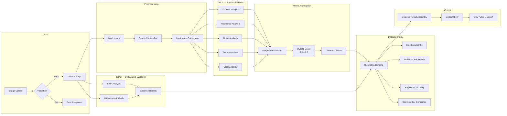
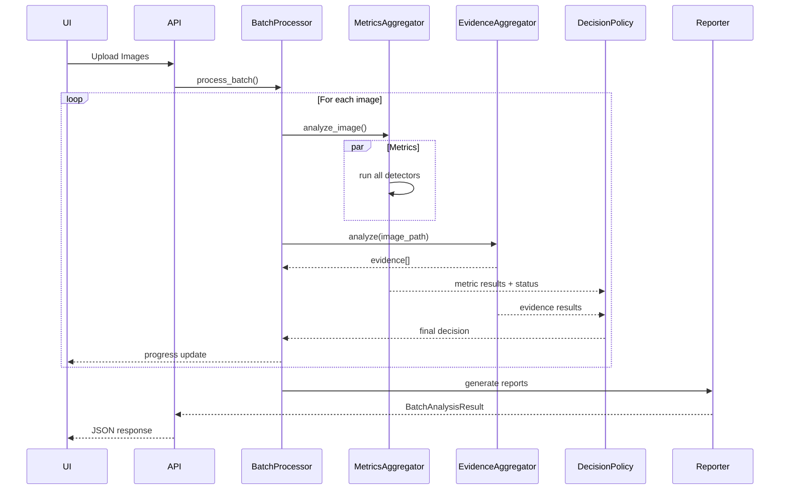
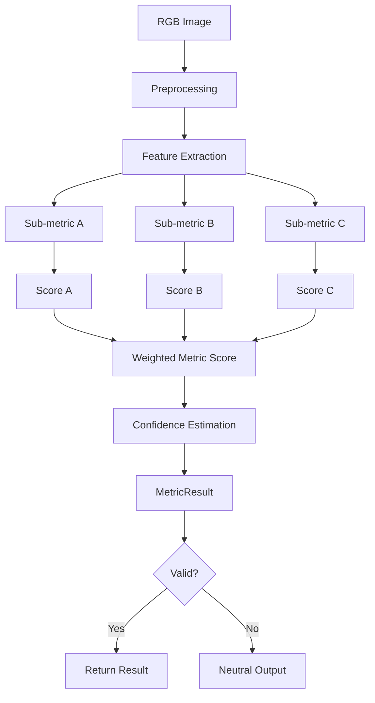
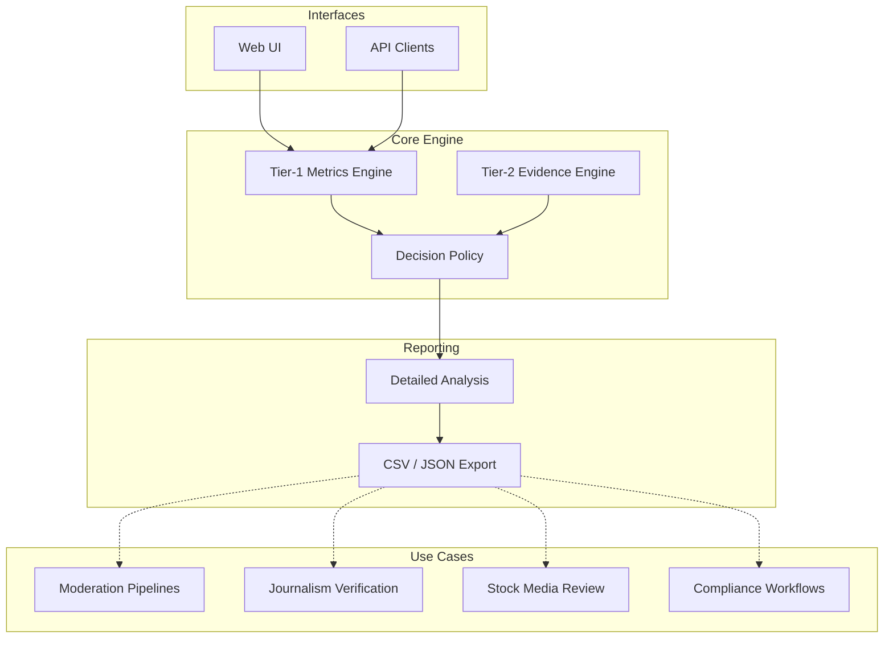
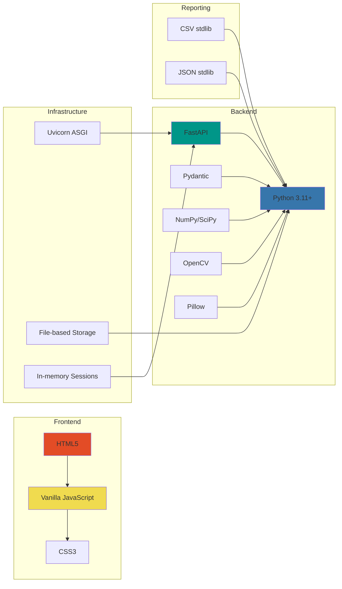
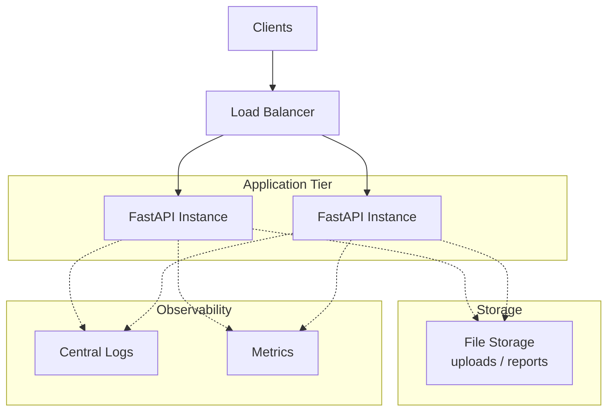

# Architecture Documentation

## Table of Contents
1. [System Overview](#system-overview)
2. [Overall Architecture](#overall-architecture)
3. [Data Pipeline](#data-pipeline)
4. [Component Details](#component-details)
5. [Product Architecture](#product-architecture)
6. [Technology Stack](#technology-stack)

---

## System Overview

AI Image Screener is a multi-tier screening system designed for first-pass screening of potentially AI-generated images in production workflows. The system combines quantitative statistical metrics (Tier-1) with declarative evidence analyzers (Tier-2) and resolves them through a deterministic decision policy to produce review-aware, multi-class verdicts with full explainability.

> **The system is explicitly not a ground-truth detector and is designed for human-in-the-loop workflows.**


**Design Principles:**
- No single metric dominates decisions
- All intermediate data preserved for explainability
- Parallel processing for batch efficiency
- Zero external ML model dependencies
- Transparent, auditable decision logic
- Separation of quantitative metrics and declarative evidence
- Deterministic policy-based decision resolution

---

## Overall Architecture

```mermaid
graph TB
    subgraph "Frontend Layer"
        UI[Web UI<br/>Single Page HTML]
    end
    
    subgraph "API Layer"
        API[FastAPI Server<br/>app.py]
        CORS[CORS Middleware]
        ERROR[Global Error Handler]
    end
    
    subgraph "Processing Layer"
        VALIDATOR[Image Validator<br/>utils/validators.py]
        BATCH[Batch Processor<br/>features/batch_processor.py]
    end
    
    subgraph "Detection Layer — Tier 1"
        AGG[Signal Aggregator<br/>metrics/signal_aggregator.py]
        
        subgraph "Independent Metrics"
            M1[Gradient PCA]
            M2[Frequency FFT]
            M3[Noise Pattern]
            M4[Texture Stats]
            M5[Color Distribution]
        end
    end
    
    subgraph "Evidence Layer — Tier 2 (non-scoring)"
        EVIDENCE_AGG[Evidence Aggregator (Tier-2)<br/>evidence_analyzers/]
        EXIF[EXIF Analyzer]
        WM[Watermark Analyzer]
    end
    
    subgraph "Decision Layer"
        POLICY[Decision Policy Engine<br/>decision_policy.py]
        DETAIL[Decision Explanation Engine]
    end
    
    subgraph "Reporting Layer"
        CSV[CSV Reporter]
        JSON[JSON Reporter]
    end
    
    subgraph "Storage Layer"
        UPLOAD[(Temp Uploads)]
        CACHE[(Processing Cache)]
        REPORTS[(Reports)]
    end
    
    UI --> API
    API --> VALIDATOR
    VALIDATOR --> BATCH
    API --> ERROR
    
    BATCH --> AGG
    AGG --> M1 & M2 & M3 & M4 & M5
    M1 & M2 & M3 & M4 & M5 --> AGG
    
    BATCH --> EVIDENCE_AGG
    EVIDENCE_AGG --> EXIF & WM
    
    AGG --> POLICY
    EVIDENCE_AGG --> DETAIL
    EVIDENCE_AGG --> POLICY
    
    POLICY --> DETAIL
    DETAIL --> CSV & JSON
    
    API -.-> UPLOAD
    BATCH -.-> CACHE
    CSV & JSON -.-> REPORTS
```

---

## Data Pipeline



---

## Component Details

### 1. Configuration Layer (`config/`)


**Key Configuration Files:**
- `settings.py`: Runtime settings, environment variables, validation
- `constants.py`: Enums, thresholds, metric parameters, explanations
- `schemas.py`: Pydantic models for type safety and validation

---

### 2. Metrics Layer (`metrics/`)

```mermaid
graph TD
    subgraph "Gradient-Field PCA"
        A1[RGB → Luminance] --> A2[Sobel Gradients]
        A2 --> A3[Sample Vectors<br/>n=10000]
        A3 --> A4[PCA Analysis]
        A4 --> A5[Eigenvalue Ratio]
        A5 --> A6{Ratio < 0.85?}
        A6 -->|Yes| A7[High Suspicion]
        A6 -->|No| A8[Low Suspicion]
    end
    
    subgraph "Frequency Analysis"
        B1[Luminance] --> B2[2D FFT]
        B2 --> B3[Radial Spectrum<br/>64 bins]
        B3 --> B4[HF Energy Ratio]
        B4 --> B5[Spectral Roughness]
        B5 --> B6[Power Law Deviation]
        B6 --> B7[Weighted Anomaly]
    end
    
    subgraph "Noise Analysis"
        C1[Luminance] --> C2[Extract Patches<br/>32×32, stride=16]
        C2 --> C3[Laplacian Filter]
        C3 --> C4[MAD Estimation]
        C4 --> C5[CV Analysis]
        C5 --> C6[IQR Analysis]
        C6 --> C7[Uniformity Score]
    end
    
    style A1 fill:#ffe1e1
    style B1 fill:#e1e1ff
    style C1 fill:#e1ffe1
```



**Metric Weights (Default):**
```
Gradient:  30%
Frequency: 25%
Noise:     20%
Texture:   15%
Color:     10%
```

### 3. Evidence Layer (`evidence_analyzers/`)

The Evidence Layer performs Tier-2 analysis using non-scoring, declarative analyzers that inspect metadata and embedded artifacts.

Evidence analyzers do not produce numeric scores. Instead, they emit directional findings that either support authenticity, indicate AI generation, or remain indeterminate.

**Evidence Outputs:**
- `direction`: AUTHENTIC | AI_GENERATED | INDETERMINATE
- `finding`: Human-readable explanation
- `confidence`: Optional (0.0–1.0)

**Current Evidence Analyzers:**
- EXIF Analyzer — metadata presence, consistency, plausibility
- Watermark Analyzer — detection of known or statistical AI watermark patterns

---

### 4. Processing Pipeline



---

### 5. Metric Execution Detail



**Example: Noise Analysis Sub-metrics**
- CV Anomaly: 40% weight
- Noise Level Anomaly: 40% weight  
- IQR Anomaly: 20% weight

---

## Product Architecture



---

## Technology Stack



**Key Dependencies:**
- **FastAPI**: Async API framework
- **NumPy/SciPy**: Numerical computation
- **OpenCV**: Image processing and filtering
- **Pillow**: Image loading and validation
- **Pydantic**: Data validation and serialization

---

## Performance Characteristics

### Processing Times (Average)
- Single image analysis: **2-4 seconds**
- Batch processing (10 images): **15-25 seconds** (parallel)
- Report generation: **1-3 seconds**

### Resource Usage
- Memory per image: **50-150 MB**
- Max concurrent workers: **4** (configurable)
- Temp storage: **~10 MB per image**

### Scalability Considerations
- **Current**: Single-server deployment
- **Bottleneck**: CPU-bound metric computation
- **Future**: Distributed processing via task queue (Celery/RabbitMQ)

---

## Security & Privacy

1. **No data persistence**: Uploaded images deleted after processing
2. **Local processing**: No external API calls
3. **Stateless design**: No user tracking
4. **Input validation**: File type, size, dimension checks
5. **Timeout protection**: 30s per-image limit

---

## Deployment Architecture



**Recommended Setup:**
- **Web Server**: Nginx (reverse proxy)
- **App Server**: Uvicorn (ASGI)
- **Process Manager**: Systemd or Supervisor
- **Monitoring**: Prometheus + Grafana
- **Logging**: Structured JSON logs to ELK stack

---

## Future Architecture Considerations

1. **Message Queue Integration**: Redis/RabbitMQ for async processing
2. **Database Layer**: PostgreSQL for result persistence and analytics
3. **Caching Layer**: Redis for threshold/config caching
4. **Distributed Storage**: S3-compatible storage for reports
5. **API Gateway**: Kong/Tyk for rate limiting and auth

---

*Document Version: 1.0*  
*Last Updated: December 2025*  
*Architecture by: Satyaki Mitra*